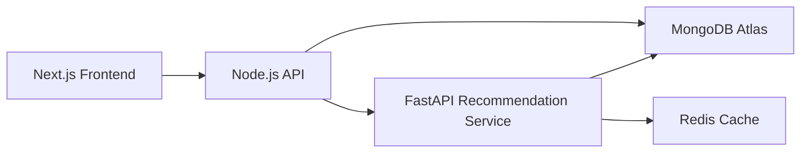
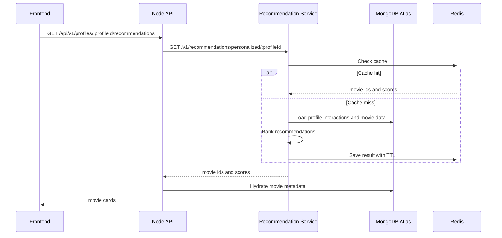

# IPANMOVIE Architecture

## Main Decision

The system uses a modular Node.js API as the main backend and a separate FastAPI service for Recommendation System work.

This keeps product logic and ML logic separated:

- Node.js API handles auth, profiles, movies, search, watchlist, ratings, comments, admin, and frontend-facing `/api/v1` endpoints.
- FastAPI Recommendation Service handles recommendation model loading, ranking, metrics, cache, and model artifacts.
- MongoDB Atlas is the source database for app data.
- Redis is used by the Recommendation Service for low-latency cached recommendation responses.

## High-Level Flow

## Node.js API Modules

- `auth`: email/password register, login, JWT session, current user.
- `profiles`: profile management per account.
- `movies`: movie metadata, detail, episodes, similar movies.
- `search`: search and browse filters.
- `watchlist`: profile watchlist.
- `ratings`: user ratings for movies.
- `comments`: movie comments and replies.
- `admin`: movie and user administration.
- `recommendation-events`: event tracking for recommendation metrics.
- `integrations/recommendation`: HTTP client to the FastAPI service.

## Auth Boundary

Auth is intentionally simple for the current phase:

- email/password only
- JWT access token
- default profile created during register
- no separate email confirmation step
- no external provider sign-in

## Recommendation Flow

## When To Split More Services

Keep the current architecture until there is real pressure to split:

- media processing becomes heavy enough to need its own queue and workers
- search needs Elasticsearch/OpenSearch instead of MongoDB Atlas Search
- notifications need a separate queue and delivery lifecycle
