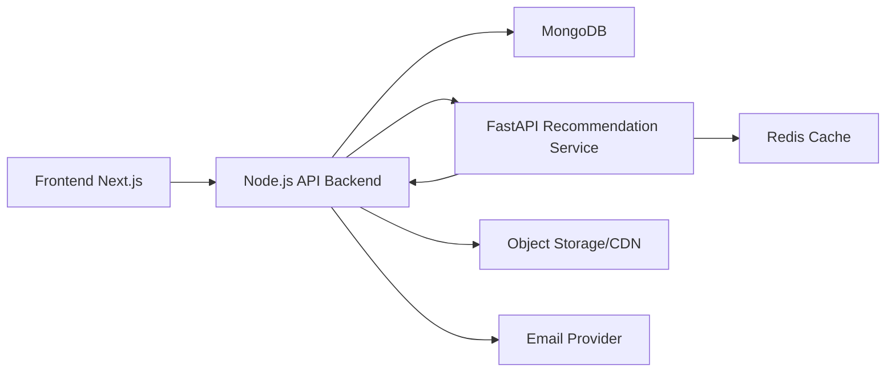
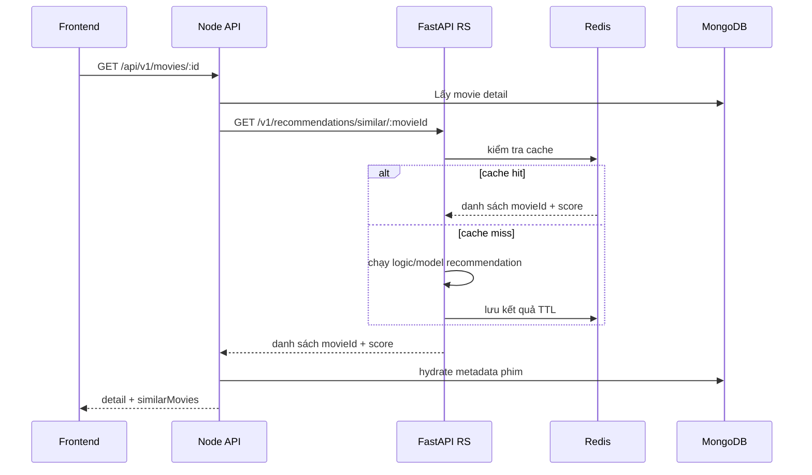

# Kiến trúc đề xuất cho IPANMOVIE

## Quyết định chính

Hệ thống dùng **Node.js backend chính + FastAPI recommendation service riêng**.

Lý do:

1. Yêu cầu web xem phim hiện tại tập trung vào nghiệp vụ CRUD, auth, search, admin và tương tác người dùng; Node.js xử lý rất phù hợp.
2. Recommendation System là miền nghiệp vụ khác biệt, có vòng đời model riêng, phụ thuộc Python/ML riêng; tách FastAPI ngay từ đầu giúp tích hợp code RS sẵn có mà không làm phình backend chính.
3. Chưa nên tách quá nhiều microservice ở giai đoạn đầu vì sẽ tăng chi phí vận hành, tracing, auth liên service và đồng bộ dữ liệu.

## Sơ đồ tổng quát

## Ranh giới module trong Node.js API

- `auth`: đăng ký, xác thực OTP, login, quên mật khẩu, Google OAuth.
- `profiles`: tối đa 5 profile/account, avatar, kids mode, PIN.
- `movies`: metadata phim, tập phim, chi tiết phim.
- `search`: tìm kiếm, filter, autosuggest.
- `watchlist`: danh sách của tôi theo từng profile.
- `ratings`: rating 1-5 sao.
- `comments`: comment/reply, chống spam.
- `admin`: quản lý phim, tập phim, user, khóa/mở khóa tài khoản.
- `integrations/recommendation`: client gọi sang FastAPI RS.

## Chiến lược cache recommendation

- `recommendations:similar:{movieId}`: phim tương tự, TTL mặc định 300 giây.
- `recommendations:personalized:{profileId}`: gợi ý cá nhân hóa theo profile.
- `recommendations:trending:global`: danh sách thịnh hành toàn hệ thống.

Invalidation:

- User rating phim → xóa cache personalized của profile đó và trending toàn cục.
- User cập nhật watch history → xóa personalized của profile đó.
- User xem hoàn thành phim → đồng thời xóa trending toàn cục.

## Luồng gợi ý phim

## Khi nào nên tách thêm service?

Chỉ tách tiếp khi có áp lực thật:

- `media-processing-service`: khi encode video trở thành pipeline nặng.
- `search-service`: khi MongoDB Atlas Search không còn đủ và cần Elasticsearch/OpenSearch.
- `notification-service`: khi email/push trở thành luồng riêng có queue.

Trước ngưỡng đó, backend module hóa là lựa chọn bền hơn microservice hóa cực đoan.
